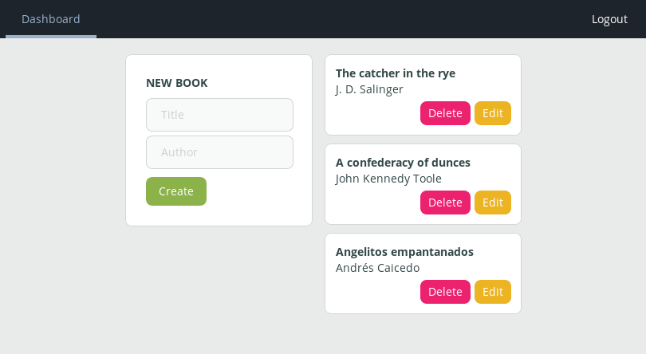
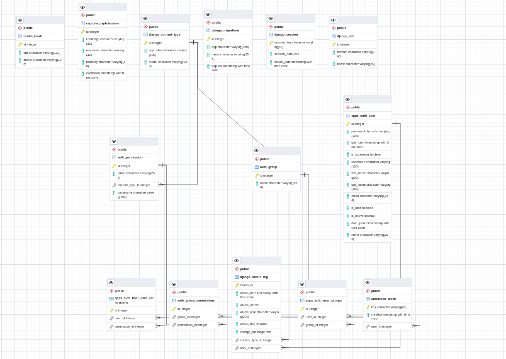

# Лобораторна робота 3
## Веозун Поліни км-81

# Book CRUD

Проста CRUD система (Create, Read, Update, Delete) application built on [Django Rest Framework][drf], [Nuxt.js][nuxt] and [Nginx][nginx].

Для продакшену є:

- Automatic HTTPS з Let's Encrypt та [Certbot][certbot].
- Капча.

Юзер може робити:

- CRUD book entries.
- Login and logout.
- Sign up.

## Installation


```bash
git clone https://github.com/luvejo/bookcrud
cd bookcrud
docker-compose -f local.yml up --build
```

http://127.0.0.1.



## ERD



## Deploying

rm `.envs/.production.example` as `.envs/.production` and customize it.

```bash
ssh $YOUR_SERVER
git clone https://github.com/luvejo/bookcrud
cd bookcrud
docker-compose -f production.yml up --build
```

ТАКОЖ: set `STAGING_ENV` to `False`
