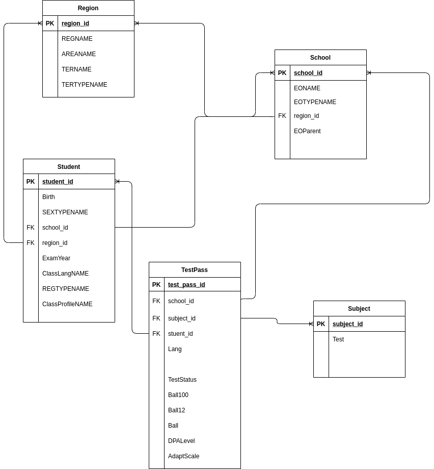
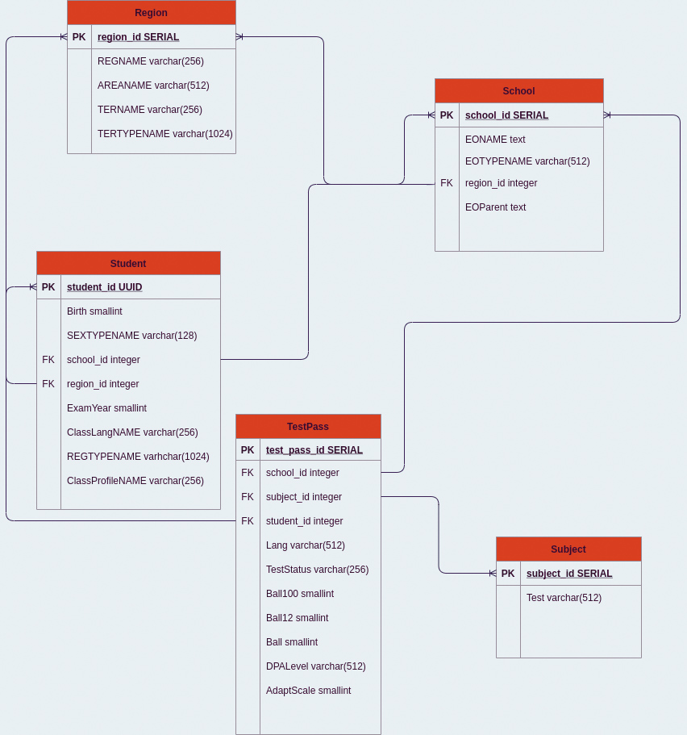

# Лабораторна робота №2 студентки групи КМ-81 Верзун Поліни

# Запуск програми
0. db та pgadmin
```docker-compose up db pgadmin```
1. Імпорт даних, потім запуск міграцій
```
. .env
source env/bin/activate
python main.py
docker-compose -f docker-compose.migrate_via_flyway.yaml up
```
2. Зразу запустити міграції за допомогою flyway.:
```
docker-compose up flyway
```

# Логічна та фізична діаграми



# Опис програми
В міграціях створюються 5 таблиць, після цього вставляються дані в кожну таблицю.

Програма працює в 3 випадках:
в БД немає нічого
в БД є пуста таблиця для кп1 (за рахунок CREATE TABLE IF NOT EXISTS)
в БД є заповнена таблиця для кп1.

# Результат роботи міграцій

1. На чисту бд
```
flyway_1  | Flyway Community Edition 7.7.2 by Redgate
flyway_1  | Database: jdbc:postgresql://db:5432/postgres (PostgreSQL 13.2)
flyway_1  | Successfully validated 10 migrations (execution time 00:00.012s)
flyway_1  | Creating Schema History table "public"."flyway_schema_history" ...
flyway_1  | 0 rows affected
flyway_1  | 0 rows affected
flyway_1  | 0 rows affected
flyway_1  | Current version of schema "public": << Empty Schema >>
flyway_1  | Migrating schema "public" to version "1 - Create zno table"
flyway_1  | 0 rows affected
flyway_1  | 0 rows affected
flyway_1  | Migrating schema "public" to version "2 - Create tables"
flyway_1  | 0 rows affected
flyway_1  | 0 rows affected
flyway_1  | 0 rows affected
flyway_1  | 0 rows affected
flyway_1  | 0 rows affected
flyway_1  | Migrating schema "public" to version "3 - Insert subject data"
flyway_1  | 0 rows affected
flyway_1  | 0 rows affected
flyway_1  | 0 rows affected
flyway_1  | 0 rows affected
flyway_1  | 0 rows affected
flyway_1  | 0 rows affected
flyway_1  | 0 rows affected
flyway_1  | 0 rows affected
flyway_1  | 0 rows affected
flyway_1  | 0 rows affected
flyway_1  | 0 rows affected
flyway_1  | Migrating schema "public" to version "4 - Insert area data"
flyway_1  | 0 rows affected
flyway_1  | 0 rows affected
flyway_1  | Migrating schema "public" to version "5 - Inserting school date"
flyway_1  | 0 rows affected
flyway_1  | Migrating schema "public" to version "6 - Inserting student data"
flyway_1  | 0 rows affected
flyway_1  | Migrating schema "public" to version "7 - Inserting test pass data"
flyway_1  | 0 rows affected
flyway_1  | 0 rows affected
flyway_1  | 0 rows affected
flyway_1  | 0 rows affected
flyway_1  | 0 rows affected
flyway_1  | 0 rows affected
flyway_1  | 0 rows affected
flyway_1  | 0 rows affected
flyway_1  | 0 rows affected
flyway_1  | 0 rows affected
flyway_1  | 0 rows affected
flyway_1  | Migrating schema "public" to version "8 - Deleting null from tables"
flyway_1  | 0 rows affected
flyway_1  | Migrating schema "public" to version "9 - Delete null from subject"
flyway_1  | 0 rows affected
flyway_1  | Migrating schema "public" to version "10 - Deleting old tables"
flyway_1  | 0 rows affected
flyway_1  | 0 rows affected
flyway_1  | Successfully applied 10 migrations to schema "public", now at version v10 (execution time 00:00.151s)
lab_2_flyway_1 exited with code 0
```
2. З даними в бд
```
flyway_1   | Flyway Community Edition 7.7.3 by Redgate
flyway_1   | Database: jdbc:postgresql://db:5432/postgres (PostgreSQL 13.2)
flyway_1   | Successfully validated 10 migrations (execution time 00:00.021s)
flyway_1   | Creating Schema History table "public"."flyway_schema_history" with baseline ...
flyway_1   | 0 rows affected
flyway_1   | 1 rows affected
flyway_1   | 0 rows affected
flyway_1   | 0 rows affected
flyway_1   | Successfully baselined schema with version: 1
flyway_1   | Current version of schema "public": 1
flyway_1   | Migrating schema "public" to version "2 - Create tables"
flyway_1   | 0 rows affected
flyway_1   | 0 rows affected
flyway_1   | 0 rows affected
flyway_1   | 0 rows affected
flyway_1   | 0 rows affected
flyway_1   | Migrating schema "public" to version "3 - Insert subject data"
flyway_1   | 2 rows affected
flyway_1   | 2 rows affected
flyway_1   | 2 rows affected
flyway_1   | 2 rows affected
flyway_1   | 2 rows affected
flyway_1   | 2 rows affected
flyway_1   | 2 rows affected
flyway_1   | 2 rows affected
flyway_1   | 2 rows affected
flyway_1   | 2 rows affected
flyway_1   | 2 rows affected
flyway_1   | Migrating schema "public" to version "4 - Insert area data"
flyway_1   | 10220 rows affected
flyway_1   | 221 rows affected
flyway_1   | Migrating schema "public" to version "5 - Inserting school date"
flyway_1   | 89658 rows affected
flyway_1   | Migrating schema "public" to version "6 - Inserting student data"
flyway_1   | 733112 rows affected
flyway_1   | Migrating schema "public" to version "7 - Inserting test pass data"
flyway_1   | 733112 rows affected
flyway_1   | 733112 rows affected
flyway_1   | 733112 rows affected
flyway_1   | 733112 rows affected
flyway_1   | 733112 rows affected
flyway_1   | 733112 rows affected
flyway_1   | 733112 rows affected
flyway_1   | 733112 rows affected
flyway_1   | 733112 rows affected
flyway_1   | 733112 rows affected
flyway_1   | 733112 rows affected
flyway_1   | Migrating schema "public" to version "8 - Deleting null from tables"
flyway_1   | 5795382 rows affected
flyway_1   | Migrating schema "public" to version "9 - Delete null from subject"
flyway_1   | 11 rows affected
flyway_1   | Migrating schema "public" to version "10 - Deleting old tables"
flyway_1   | 0 rows affected
flyway_1   | 0 rows affected
flyway_1   | Successfully applied 9 migrations to schema "public", now at version v10 (execution time 03:49.889s)
lab_2_flyway_1 exited with code 0


```
